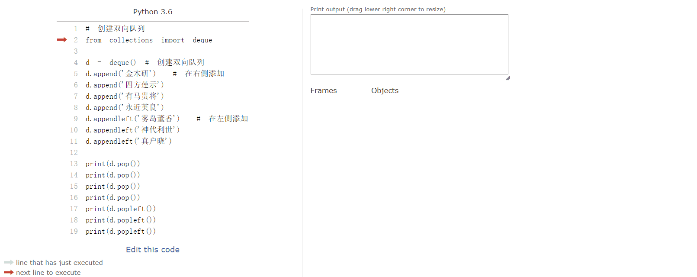

# collections模块

* [couter](#couter): 计数器
* [defaultdict](#defaultdict): 默认值字典
* [OrderedDict](#OrderedDict): 有序字典
* [deque](#deque): 双向队列
* Iterator, Iterable

## couter

``` python
from collections import Counter 

# counter（计数器） 是对可迭代对象进行计数
# Counter({'我': 3, '地': 2, '球': 2, '，': 2, '来': 1, '自': 1, '是': 1, '人': 1, '！': 1})
print(Counter('我来自地球，我是地球人，我！'))
dic = {'a':'张三', 'b':'张三丰', 'c':'张三'}
# counter之字典的奇技淫巧 以字典的形式返回key和value出现的次数
print(Counter(dic.keys())) 
print(Counter(dic.values()))
```

## defaultdict

``` python
from collections import defaultdict

# 给字典设置一个默认值
dd = defaultdict(lambda: '喰种')  # 必须是callable的，可调用的 这个字典是空的

print(dd['金木研'])
print(dd)
```

## OrderedDict

``` python
# 设置一个有序字典（主要是字典在python3.5之前是无序的）
from collections import OrderedDict
dic = OrderedDict()

dic['a'] = '金木研'
dic['b'] = '神代利世'
print(dic)
print(dic.get('a'))
print(dic.values())
print(dic['b'])
```

## deque

``` python
# 创建双向队列
from collections import deque

d = deque() # 创建双向队列
d.append('金木研')  # 在右侧添加
d.append('四方莲示')
d.append('有马贵将')
d.append('永近英良')
d.appendleft('雾岛董香')  # 在左侧添加
d.appendleft('神代利世')
d.appendleft('真户晓')

print(d.pop())  # 从右侧弹出
print(d.pop())
print(d.pop())
print(d.pop())
print(d.popleft())  # 从左侧弹出
print(d.popleft())
print(d.popleft())
```


