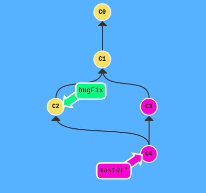
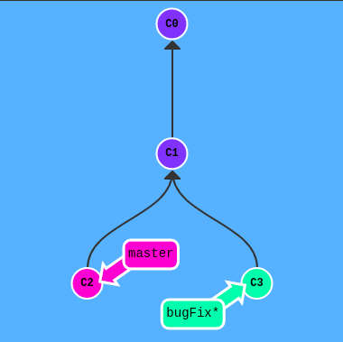
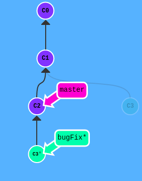

# git merge与git rebase的区别

## git merge

git merge合并两个分支时会产生一个特殊的提交记录，他有两个父节点。



## git rebase

git rebase 实际上就是取出一系列的提交记录，“复制”他们，然后在另一个地方逐个放下去。

rebase相对于merge的优势：可以创造更线性的提交历史。

下面有一个示例：

我们现在有两个分支，一个是master另一个是bugFix：



现在在bugFix分支上进行，rebase操作

``` shell
git rebase master
```



然后切换到master分支

``` shell
git checkout master
```


再次进行rebase操作

``` shell
git rebase bugFix
```


