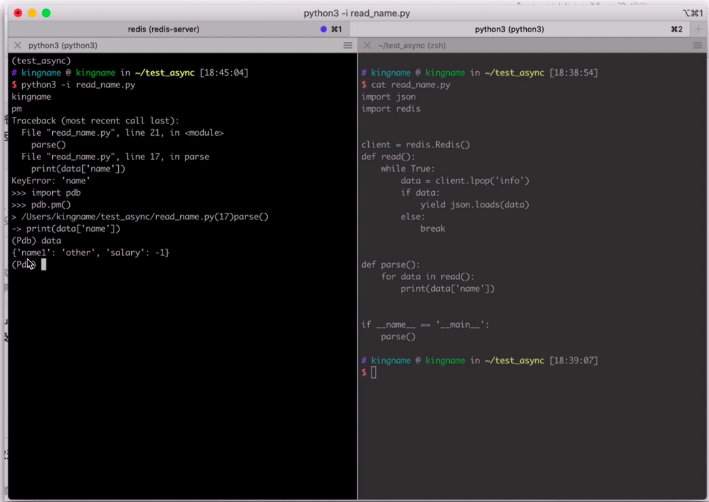

# 日常调试技巧

## 使用vscode对Flask进行调试

这里需要注意的有两点：

1. 调试过程中flask的默认端口为5000，如果系统占用必须使用`"args": ["--port","port"]`进行修改（app.run中配置不生效，修改配置文件`launch.json`的port配置项也不生效）。
2. vscode默认只会调试用户代码，如果要是调试标准库或者第三方模块的话需要设置`"justMyCode": false`

快捷键：

|   名称   | 快捷键 | 命令  |
| :------: | :----: | :---: |
| 调试模式 | `F5` | Start Debugging |
| 运行模式 | `Ctrl+F5` | Run Without Debugging |
| 继续 | `F5` | start/continue |
| 暂停 | `F6` |  |
| 单步跳过 | `F10` |  |
| 单步调试 | `F11` | step into |
| 单步跳出 | `Shift+F11` | step out |
| 重启 | `Ctrl+Shift+F5` |  |
| 关闭 | Shift+F5 | stop |
|  | Ctrl+K Ctrl+I | show hover |
|  | F9 | toggle breakpoint |

调试配置：launch.json

``` json
{
    // 使用 IntelliSense 了解相关属性。 
    // 悬停以查看现有属性的描述。
    // 欲了解更多信息，请访问: https://go.microsoft.com/fwlink/?linkid=830387
    "version": "0.2.0",
    "configurations": [
        {
            "name": "Python: Flask",
            "type": "python",
            "request": "launch",
            "module": "flask",
            "env": {
                "FLASK_APP": "app.py",
                "FLASK_ENV": "development"
            },
            "args": [
                "run",
                "--no-debugger",
                "--port","5555"
            ],
            "jinja": true,
            "justMyCode": false
        }
    ]
}
```

## 在命令行使用pdb查看导致程序崩溃的数据

使用python -i参数运行文件，出现错误后会进入交互模式，使用pdb查看错误信息

